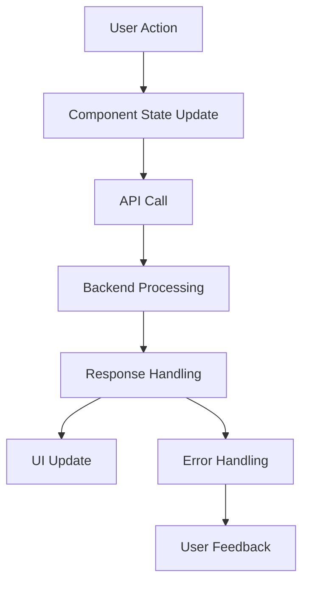

# Design Document

## Overview

This design addresses five critical issues in the HR document creation flow and related functionality. The solution involves fixing auto-save behavior, implementing organization-specific access roles, resolving pagination errors, ensuring proper data loading, and implementing autocomplete functionality for member selection.

## Architecture

### Component Architecture

The fixes will be implemented across several layers:

1. **API Layer**: Ensure proper data fetching and error handling
2. **Component Layer**: Fix UI components and data flow
3. **State Management**: Improve data validation and state handling
4. **User Experience**: Add loading states and error recovery

### Data Flow



## Components and Interfaces

### 1. Document Creation Auto-Save Fix

**Problem**: Auto-save shows "Auto Saved" but doesn't create documents
**Root Cause**: Auto-save logic doesn't distinguish between create and update operations

**Solution**:
- Modify `MarkdownEditor` component to track document creation state
- Update auto-save logic to handle new document creation
- Add proper error handling for failed document creation

**Interface Changes**:
```typescript
interface DocumentEditorState {
  isNewDocument: boolean;
  documentId?: string;
  hasBeenSaved: boolean;
}
```

### 2. Organization-Specific Access Roles

**Problem**: Hardcoded access roles instead of organization-specific roles
**Root Cause**: Both frontend `MarkdownEditor` uses static role options AND backend validates against hardcoded role list

**Solution**:

**Frontend Changes**:
- Fetch organization roles using `useGetOrganizationRolesQuery`
- Transform role data for Select component
- Add fallback to default roles when organization roles unavailable

**Backend Changes**:
- Update `HRDocumentService.validateDocument()` to validate access_roles against actual organization roles
- Add database query to fetch valid organization roles for validation
- Ensure role validation joins with `organization_roles` table
- Update access role validation to use role names from the organization
- **Create migration to reconcile existing document access_roles with organization roles**

**Interface Changes**:
```typescript
interface OrganizationRole {
  id: string;
  name: string;
  description?: string;
  permissions: string[];
  organization_id: string;
  rank: number;
  is_active: boolean;
}

interface AccessRoleOption extends SelectOption {
  value: string; // role name, not ID
  label: string; // role name for display
  description?: string;
}
```

**Backend Validation Changes**:
```typescript
// In HRDocumentService.validateDocument()
async validateAccessRoles(organizationId: string, accessRoles: string[]): Promise<string[]> {
  const validRoles = await db('organization_roles')
    .where({ organization_id: organizationId, is_active: true })
    .pluck('name');
  
  return accessRoles.filter(role => !validRoles.includes(role));
}
```

### 3. Skills Page Pagination Error Fix

**Problem**: `Cannot read properties of undefined (reading 'page')`
**Root Cause**: Pagination component renders before skills data is available

**Solution**:
- Add null checks for skills data before rendering pagination
- Implement proper loading states
- Add error boundaries for graceful error handling

**Interface Changes**:
```typescript
interface SkillsPageState {
  skillsData?: ListResponse<Skill>;
  isLoading: boolean;
  error?: string;
}
```

### 4. Skills Dropdown Data Loading

**Problem**: Skills dropdown doesn't show actual skills
**Root Cause**: Skills data not properly loaded or transformed for dropdown

**Solution**:
- Ensure skills query is properly triggered
- Transform skills data for Select component
- Add loading and error states to dropdown

### 5. Performance Review Member Autocomplete

**Problem**: Member dropdown is not autocomplete and shows "No options found"
**Root Cause**: Using basic Select instead of searchable/autocomplete component

**Solution**:
- Implement autocomplete functionality using Headless UI Combobox
- Add search filtering for member names
- Implement proper loading and error states

**Interface Changes**:
```typescript
interface MemberAutocompleteProps {
  organizationId: string;
  value?: string;
  onChange: (memberId: string) => void;
  placeholder?: string;
  error?: string;
}
```

## Data Models

### Organization Role Model
```typescript
interface OrganizationRole {
  id: string;
  organization_id: string;
  name: string;
  description?: string;
  permissions: string[];
  rank: number;
  is_active: boolean;
  is_editable: boolean;
  created_at: string;
  updated_at: string;
}
```

### Document Access Role Validation
```typescript
interface DocumentAccessValidation {
  organizationId: string;
  requestedRoles: string[];
  validRoles: string[];
  invalidRoles: string[];
}
```

### Document Access Role Migration
```typescript
interface DocumentRoleMigration {
  documentId: string;
  organizationId: string;
  oldAccessRoles: string[];
  newAccessRoles: string[];
  migrationStatus: 'pending' | 'completed' | 'failed';
  migrationErrors?: string[];
}
```

### Member Model (for autocomplete)
```typescript
interface OrganizationMember {
  id: string;
  rsi_handle: string;
  display_name?: string;
  avatar_url?: string;
  roles: string[];
  joined_at: string;
}
```

## Error Handling

### Document Creation Errors
- Network failures during auto-save
- Validation errors for required fields
- Permission errors for document creation
- **Access role validation errors when roles don't exist in organization**

### Data Loading Errors
- Organization roles loading failures
- Skills data loading failures
- Member data loading failures

### Migration Errors
- **Documents with invalid access roles that can't be mapped to organization roles**
- **Organizations without proper role structure**
- **Orphaned documents with roles that no longer exist**

### User Experience Errors
- Graceful degradation when APIs are unavailable
- Clear error messages with retry options
- Loading states to prevent user confusion
- **Migration status indicators for administrators**

## Migration Strategy

### Document Access Role Migration

**Problem**: Existing documents have access_roles as string arrays with hardcoded values like `['owner', 'admin', 'member']` that don't correspond to actual organization roles in the `organization_roles` table.

**Migration Approach**:

1. **Analysis Phase**:
   - Query all documents to identify unique access_roles values
   - Map common role names to organization role equivalents
   - Identify documents with unmappable roles

2. **Mapping Strategy**:
   ```sql
   -- Create role mapping table for migration
   CREATE TABLE document_role_migration_map (
     old_role_name VARCHAR(255),
     organization_id UUID,
     new_role_name VARCHAR(255),
     migration_status VARCHAR(50)
   );
   ```

3. **Migration Logic**:
   - For each organization, map common roles (owner → Owner, admin → Administrator, etc.)
   - Create missing roles if they don't exist in organization
   - Update document access_roles to use actual organization role names
   - Log unmappable roles for manual review

4. **Rollback Strategy**:
   - Keep backup of original access_roles in migration table
   - Provide rollback script if migration causes issues

5. **Validation**:
   - Ensure all migrated documents have valid organization roles
   - Verify role permissions are maintained
   - Check document accessibility after migration

## Testing Strategy

### Unit Tests
- Document auto-save logic
- Organization role data transformation
- Skills pagination error handling
- Member autocomplete filtering
- **Document role migration logic**
- **Role validation against organization roles**

### Integration Tests
- Document creation flow end-to-end
- Skills page loading and pagination
- Performance review member selection
- **Document access after role migration**
- **Role validation in document creation**

### Migration Tests
- **Role mapping accuracy**
- **Migration rollback functionality**
- **Data integrity after migration**
- **Performance impact of migration**

### Error Scenario Tests
- Network failure handling
- Invalid data handling
- Permission error handling
- **Migration failure recovery**
- **Invalid role handling**

## Implementation Approach

### Phase 1: Critical Fixes
1. Fix document auto-save functionality
2. Resolve skills page pagination error
3. Fix skills dropdown data loading

### Phase 2: Backend Role Validation & Migration
1. **Create database migration to reconcile existing document access_roles**
2. **Implement role mapping logic for legacy documents**
3. Update backend document validation to use organization roles
4. Add proper role validation queries
5. Ensure role-document relationship integrity
6. **Add migration status tracking and reporting**

### Phase 3: Frontend Role Integration
1. Implement organization-specific access roles in frontend
2. Add member autocomplete functionality
3. Update role selection UI components

### Phase 4: Polish
1. Improve error handling and user feedback
2. Add comprehensive loading states
3. Optimize performance and caching
4. Add role validation error messages