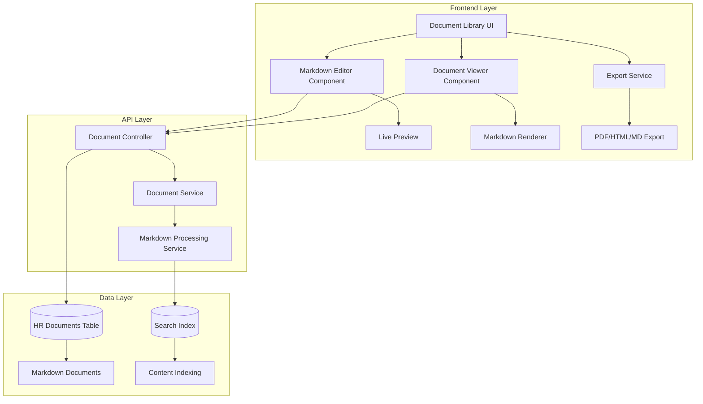

# HR Document Markdown Refactor - Design Document

## Overview

This design document outlines the technical approach for completely replacing the HR document management system's file upload functionality with a markdown-based text editor system. The solution leverages existing dependencies (`@uiw/react-md-editor` and `react-markdown`) to provide a streamlined, integrated document creation and management experience.

## Architecture

### High-Level Architecture Changes



### Component Architecture

The system will be completely markdown-based with no file upload functionality:

1. **Frontend Components**
   - Document Library with integrated markdown editor
   - Markdown Editor component using `@uiw/react-md-editor`
   - Document Viewer with markdown rendering using `react-markdown`
   - Export Service for client-side PDF, HTML, and markdown generation

2. **Backend Services**
   - Document Service focused on markdown content management
   - Markdown Processing Service for content validation and search indexing
   - Enhanced Search Service with full-text indexing for markdown content

3. **Database Schema**
   - Simplified `hr_documents` table with `content` field for markdown storage
   - Removed file-related fields (file_path, file_type, file_size)
   - Enhanced indexing for content search capabilities

## Components and Interfaces

### Frontend Components

#### 1. Document Library Component

```typescript
interface DocumentLibraryProps {
  onDocumentSelect?: (document: Document) => void;
  allowCreate?: boolean;
  showAcknowledgments?: boolean;
}

interface DocumentLibraryState {
  documents: Document[];
  currentFolder: string;
  searchQuery: string;
  selectedDocument: Document | null;
  isCreatingDocument: boolean;
  editingDocument: Document | null;
}
```

#### 4. Frontend Export Service

```typescript
interface DocumentExportService {
  exportToHtml(content: string, metadata: DocumentMetadata): string;
  exportToPdf(content: string, metadata: DocumentMetadata): Promise<Blob>;
  exportToMarkdown(content: string, metadata: DocumentMetadata): string;
  downloadFile(content: string | Blob, filename: string, mimeType: string): void;
}

interface ExportOptions {
  includeMetadata?: boolean;
  includeTableOfContents?: boolean;
  customStyles?: string;
  pageFormat?: 'A4' | 'Letter';
}
```

#### 2. Markdown Editor Component

```typescript
interface MarkdownEditorProps {
  initialContent?: string;
  onSave: (content: string, metadata: DocumentMetadata) => Promise<void>;
  onCancel: () => void;
  document?: Document; // For editing existing documents
  isLoading?: boolean;
}

interface DocumentMetadata {
  title: string;
  description?: string;
  folder_path: string;
  requires_acknowledgment: boolean;
  access_roles: string[];
}
```

#### 3. Document Viewer Component

```typescript
interface DocumentViewerProps {
  document: Document;
  onEdit?: () => void;
  onAcknowledge?: () => void;
  showAcknowledgmentStatus?: boolean;
}

interface DocumentContent {
  content: string;
  word_count: number;
  estimated_reading_time: number;
}
```

### Backend API Interfaces

#### 1. Document Controller

```typescript
// Document endpoints (markdown-only)
POST   /api/organizations/:orgId/documents
PUT    /api/organizations/:orgId/documents/:id
GET    /api/organizations/:orgId/documents/:id
GET    /api/organizations/:orgId/documents
DELETE /api/organizations/:orgId/documents/:id

// Search endpoint with content search
GET    /api/organizations/:orgId/documents/search
```

#### 2. Document Service Interface

```typescript
interface DocumentService {
  // Document CRUD methods
  createDocument(data: CreateDocumentData): Promise<Document>;
  updateDocument(id: string, data: UpdateDocumentData): Promise<Document>;
  getDocument(id: string): Promise<Document>;
  deleteDocument(id: string): Promise<boolean>;
  listDocuments(organizationId: string, options: ListOptions): Promise<DocumentList>;
  
  // Search and validation methods
  searchDocuments(query: string, options: SearchOptions): Promise<SearchResult>;
  validateContent(content: string): Promise<ValidationResult>;
}

interface CreateDocumentData {
  organization_id: string;
  title: string;
  description?: string;
  content: string;
  folder_path?: string;
  requires_acknowledgment?: boolean;
  access_roles?: string[];
  created_by: string;
}

interface UpdateDocumentData {
  title?: string;
  description?: string;
  content?: string;
  folder_path?: string;
  requires_acknowledgment?: boolean;
  access_roles?: string[];
}
```

#### 3. Markdown Processing Service

```typescript
interface MarkdownProcessingService {
  validateContent(content: string): ValidationResult;
  extractPlainText(content: string): string;
  sanitizeContent(content: string): string;
  calculateWordCount(content: string): number;
  estimateReadingTime(content: string): number;
}

interface ValidationResult {
  isValid: boolean;
  errors: string[];
  warnings: string[];
  wordCount: number;
  estimatedReadingTime: number;
}
```

## Data Models

### HR Document Model

```typescript
interface HRDocument {
  id: string;
  organization_id: string;
  title: string;
  description?: string;
  content: string;
  folder_path: string;
  version: number;
  requires_acknowledgment: boolean;
  access_roles: string[];
  created_by: string;
  created_at: Date;
  updated_at: Date;
  word_count: number;
  estimated_reading_time: number;
}
```

### Database Schema Changes

```sql
-- Migration: Replace file fields with markdown content
ALTER TABLE hr_documents 
ADD COLUMN content TEXT NOT NULL,
ADD COLUMN word_count INTEGER DEFAULT 0,
ADD COLUMN estimated_reading_time INTEGER DEFAULT 0;

-- Remove file-related fields (no longer needed)
ALTER TABLE hr_documents 
DROP COLUMN file_path,
DROP COLUMN file_type,
DROP COLUMN file_size;

-- Add indexes for content search
CREATE INDEX idx_hr_documents_content_search ON hr_documents USING gin(to_tsvector('english', content));
CREATE INDEX idx_hr_documents_word_count ON hr_documents (word_count);
```

## Error Handling

### Frontend Error Handling

```typescript
interface DocumentError {
  type: 'validation' | 'network' | 'permission' | 'storage';
  message: string;
  details?: any;
}

// Error boundaries for document components
class DocumentErrorBoundary extends React.Component {
  // Handle markdown editor crashes
  // Handle document rendering failures
  // Provide fallback UI for corrupted documents
}
```

### Backend Error Handling

```typescript
// Custom error types for markdown processing
class MarkdownValidationError extends Error {
  constructor(public errors: string[], public warnings: string[]) {
    super('Markdown validation failed');
  }
}

class DocumentContentError extends Error {
  constructor(message: string, public documentId: string) {
    super(message);
  }
}

// Error handling middleware
const handleDocumentErrors = (error: Error, req: Request, res: Response, next: NextFunction) => {
  if (error instanceof MarkdownValidationError) {
    return res.status(400).json({
      success: false,
      error: 'Invalid markdown content',
      details: { errors: error.errors, warnings: error.warnings }
    });
  }
  // Handle other document-related errors
};
```

## Testing Strategy

### Frontend Testing

```typescript
// Component testing with React Testing Library
describe('MarkdownEditor', () => {
  it('should render editor with toolbar');
  it('should show live preview');
  it('should handle save operations');
  it('should validate content before saving');
  it('should handle large documents efficiently');
});

describe('DocumentViewer', () => {
  it('should render markdown documents correctly');
  it('should handle acknowledgment actions');
  it('should sanitize markdown content');
  it('should display word count and reading time');
});

// Integration testing
describe('Document Library Integration', () => {
  it('should create markdown documents end-to-end');
  it('should edit existing documents');
  it('should search within document content');
  it('should export documents in multiple formats');
});
```

### Backend Testing

```typescript
// Service testing
describe('MarkdownProcessingService', () => {
  it('should validate markdown syntax');
  it('should render markdown to HTML safely');
  it('should extract plain text for search');
  it('should generate PDF exports');
});

describe('DocumentService', () => {
  it('should create markdown documents');
  it('should update document content and metadata');
  it('should perform full-text search on markdown content');
  it('should calculate word count and reading time');
});

// API testing
describe('Document API', () => {
  it('should handle document CRUD operations');
  it('should validate markdown content');
  it('should maintain acknowledgment functionality');
  it('should support content search');
});
```

## Security Considerations

### Content Sanitization

```typescript
// Markdown content sanitization
const sanitizeMarkdown = (content: string): string => {
  // Remove potentially dangerous HTML tags
  // Sanitize links and images
  // Prevent XSS attacks through markdown injection
  // Validate file size limits for content
};

// HTML rendering security
const renderMarkdownSafely = (content: string): string => {
  return marked(content, {
    sanitize: true,
    sanitizer: DOMPurify.sanitize,
    breaks: true,
    gfm: true
  });
};
```

### Access Control

```typescript
// Permission checking for document access
const checkDocumentAccess = async (
  document: HRDocument,
  user: User,
  action: 'read' | 'write' | 'delete'
): Promise<boolean> => {
  // Check user roles against document access_roles
  // Validate organization membership
  // Check content editing permissions
};
```

## Frontend Export Implementation

### Export Libraries and Dependencies

```typescript
// Required dependencies for frontend export functionality
import jsPDF from 'jspdf';
import html2canvas from 'html2canvas';
import { marked } from 'marked';
import DOMPurify from 'dompurify';

// Export service implementation
class DocumentExportService {
  async exportToPdf(content: string, metadata: DocumentMetadata): Promise<Blob> {
    // Render markdown to HTML
    const html = marked(content);
    const sanitizedHtml = DOMPurify.sanitize(html);
    
    // Create temporary container for rendering
    const container = document.createElement('div');
    container.innerHTML = sanitizedHtml;
    container.style.width = '210mm'; // A4 width
    container.style.padding = '20mm';
    document.body.appendChild(container);
    
    // Convert to canvas and then PDF
    const canvas = await html2canvas(container);
    const pdf = new jsPDF();
    const imgData = canvas.toDataURL('image/png');
    pdf.addImage(imgData, 'PNG', 0, 0, 210, 297);
    
    // Cleanup
    document.body.removeChild(container);
    
    return pdf.output('blob');
  }
  
  exportToHtml(content: string, metadata: DocumentMetadata): string {
    const html = marked(content);
    const sanitizedHtml = DOMPurify.sanitize(html);
    
    return `
      <!DOCTYPE html>
      <html>
        <head>
          <title>${metadata.title}</title>
          <meta charset="utf-8">
          <style>
            body { font-family: -apple-system, BlinkMacSystemFont, 'Segoe UI', sans-serif; }
            /* Add print-friendly styles */
          </style>
        </head>
        <body>
          <h1>${metadata.title}</h1>
          ${metadata.description ? `<p><em>${metadata.description}</em></p>` : ''}
          ${sanitizedHtml}
        </body>
      </html>
    `;
  }
  
  exportToMarkdown(content: string, metadata: DocumentMetadata): string {
    return `---
title: ${metadata.title}
description: ${metadata.description || ''}
folder: ${metadata.folder_path}
requires_acknowledgment: ${metadata.requires_acknowledgment}
access_roles: ${metadata.access_roles.join(', ')}
---

# ${metadata.title}

${metadata.description ? `${metadata.description}\n\n` : ''}${content}`;
  }
}
```

## Performance Optimizations

### Frontend Performance

```typescript
// Lazy loading for large documents
const MarkdownEditor = React.lazy(() => import('./MarkdownEditor'));

// Debounced auto-save
const useAutoSave = (content: string, onSave: (content: string) => void) => {
  const debouncedSave = useMemo(
    () => debounce(onSave, 2000),
    [onSave]
  );
  
  useEffect(() => {
    if (content) {
      debouncedSave(content);
    }
  }, [content, debouncedSave]);
};

// Virtual scrolling for large document lists
const DocumentList = ({ documents }: { documents: Document[] }) => {
  // Use react-window for efficient rendering of large lists
};
```

### Backend Performance

```typescript
// Content caching
const contentCache = new Map<string, { html: string, timestamp: number }>();

const getCachedRenderedContent = (documentId: string, content: string): string => {
  const cached = contentCache.get(documentId);
  if (cached && Date.now() - cached.timestamp < 300000) { // 5 minutes
    return cached.html;
  }
  
  const html = renderMarkdownSafely(content);
  contentCache.set(documentId, { html, timestamp: Date.now() });
  return html;
};

// Database query optimization
const getDocumentsWithContent = async (organizationId: string, options: QueryOptions) => {
  // Use selective field loading
  // Implement pagination for large result sets
  // Use database-level full-text search for content queries
};
```

## Migration Strategy

### Phase 1: Database Schema Update
1. Add new columns to `hr_documents` table
2. Make file-related columns nullable
3. Add content search indexes
4. Deploy database changes

### Phase 2: Backend API Enhancement
1. Implement markdown processing service
2. Add new API endpoints for markdown documents
3. Enhance existing endpoints to support both types
4. Deploy backend changes with feature flags

### Phase 3: Frontend Implementation
1. Implement markdown editor component
2. Update document library to support creation mode
3. Enhance document viewer for markdown rendering
4. Deploy frontend changes with progressive rollout

### Phase 4: Full Rollout
1. Enable markdown document creation for all users
2. Remove file upload UI (keep API for backward compatibility)
3. Monitor performance and user adoption
4. Gather feedback and iterate

## Monitoring and Analytics

### Performance Metrics
- Document creation and editing times
- Search query performance with content indexing
- Editor loading and rendering times
- Database query performance for content operations

### User Experience Metrics
- Document creation completion rates
- Editor usage patterns and feature adoption
- Search success rates with content search
- Export functionality usage and success rates

### System Health Metrics
- Content storage growth rates
- Search index performance
- Cache hit rates for rendered content
- Error rates for markdown processing

This design provides a streamlined approach to the HR document system, focusing entirely on markdown-based documents for better user experience and simpler architecture.