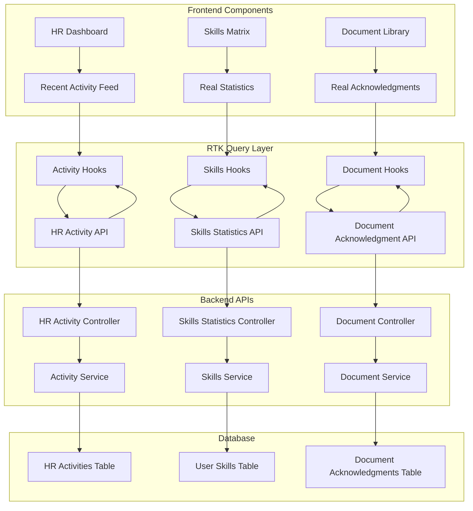

# Design Document

## Overview

This design addresses the elimination of dummy data in the HR Management System frontend by implementing proper API integration, adding missing backend endpoints, and ensuring all components use real data from the backend. The solution focuses on completing the RTK Query integration, implementing missing API endpoints, and establishing consistent data flow patterns.

## Architecture

### Current State Analysis

**Problematic Areas Identified:**
1. HR Dashboard Recent Activity uses hardcoded placeholder data
2. Skills Matrix displays static "0" values instead of real statistics
3. Document Library simulates acknowledgment status with `Math.random()`
4. Some API endpoints may be missing for detailed statistics
5. Incomplete RTK Query integration in certain components

### Target Architecture



## Components and Interfaces

### 1. HR Activity Feed System

#### Backend Implementation

**New API Endpoints:**
```typescript
// GET /api/organizations/:id/hr-activities
interface HRActivityEndpoint {
  query: {
    page?: number;
    limit?: number;
    activity_types?: string[];
    date_from?: string;
    date_to?: string;
  };
  response: {
    data: HRActivity[];
    total: number;
    page: number;
    limit: number;
  };
}

interface HRActivity {
  id: string;
  organization_id: string;
  activity_type: 'application_submitted' | 'application_status_changed' | 'onboarding_completed' | 'performance_review_submitted' | 'skill_verified' | 'document_acknowledged';
  user_id: string;
  user_handle: string;
  user_avatar_url?: string;
  title: string;
  description: string;
  metadata: Record<string, any>;
  created_at: string;
}
```

**Controller Implementation:**
```typescript
// backend/src/controllers/hr_activity_controller.ts
export class HRActivityController {
  async getOrganizationActivities(req: Request, res: Response): Promise<void> {
    const organizationId = req.params.id;
    const { page = 1, limit = 20, activity_types, date_from, date_to } = req.query;
    
    const activities = await this.activityService.getHRActivities(organizationId, {
      page: parseInt(page as string),
      limit: Math.min(parseInt(limit as string), 50),
      activityTypes: activity_types ? (activity_types as string).split(',') : undefined,
      dateFrom: date_from ? new Date(date_from as string) : undefined,
      dateTo: date_to ? new Date(date_to as string) : undefined,
    });
    
    res.json({
      success: true,
      data: activities.data,
      total: activities.total,
      page: activities.page,
      limit: activities.limit,
    });
  }
}
```

#### Frontend Integration

**RTK Query API Extension:**
```typescript
// frontend/src/services/apiSlice.ts
getHRActivities: builder.query<
  {
    data: HRActivity[];
    total: number;
    page: number;
    limit: number;
  },
  {
    organizationId: string;
    page?: number;
    limit?: number;
    activityTypes?: string[];
    dateFrom?: string;
    dateTo?: string;
  }
>({
  query: ({ organizationId, page = 1, limit = 20, activityTypes, dateFrom, dateTo }) => {
    const params = new URLSearchParams({
      page: page.toString(),
      limit: limit.toString(),
    });
    if (activityTypes?.length) params.append('activity_types', activityTypes.join(','));
    if (dateFrom) params.append('date_from', dateFrom);
    if (dateTo) params.append('date_to', dateTo);
    
    return `/api/organizations/${organizationId}/hr-activities?${params.toString()}`;
  },
  providesTags: (result, error, { organizationId }) => [
    { type: 'HRActivity', id: organizationId },
    { type: 'HRActivity', id: 'LIST' },
  ],
  keepUnusedDataFor: 300, // 5 minutes cache
}),
```

**Component Update:**
```typescript
// frontend/src/components/hr/hr_dashboard.tsx
const HRDashboard: React.FC<HRDashboardProps> = ({ organizationId }) => {
  // Replace hardcoded activity data with real API call
  const { data: recentActivities, isLoading: activitiesLoading } = useGetHRActivitiesQuery({
    organizationId,
    limit: 5, // Show only 5 most recent
  });

  // Remove hardcoded placeholder activities
  const renderRecentActivities = () => {
    if (activitiesLoading) {
      return (
        <div className="space-y-4">
          {[1, 2, 3].map(i => (
            <div key={i} className="animate-pulse">
              <div className="h-16 bg-white/5 rounded-lg"></div>
            </div>
          ))}
        </div>
      );
    }

    if (!recentActivities?.data.length) {
      return (
        <div className="text-center py-8">
          <ClockIcon className="w-12 h-12 text-tertiary mx-auto mb-4" />
          <ComponentTitle className="text-primary mb-2">
            No Recent Activity
          </ComponentTitle>
          <ComponentSubtitle className="text-secondary">
            HR activities will appear here as they occur.
          </ComponentSubtitle>
        </div>
      );
    }

    return (
      <div className="space-y-4">
        {recentActivities.data.map((activity) => (
          <div key={activity.id} className="flex items-start space-x-4 p-4 bg-white/5 rounded-lg">
            <div className="w-10 h-10 bg-white/10 rounded-lg flex items-center justify-center flex-shrink-0">
              {getActivityIcon(activity.activity_type)}
            </div>
            <div className="flex-1 min-w-0">
              <h4 className="text-sm font-semibold text-primary">
                {activity.title}
              </h4>
              <p className="text-sm text-secondary">
                {activity.description}
              </p>
              <p className="text-xs text-tertiary mt-1">
                {formatRelativeTime(activity.created_at)}
              </p>
            </div>
          </div>
        ))}
      </div>
    );
  };
};
```

### 2. Skills Statistics Integration

#### Backend Implementation

**Enhanced Skills API:**
```typescript
// GET /api/organizations/:id/skills/:skillId/statistics
interface SkillStatistics {
  skill_id: string;
  total_members: number;
  verified_members: number;
  verification_rate: number;
  proficiency_breakdown: {
    beginner: number;
    intermediate: number;
    advanced: number;
    expert: number;
  };
  recent_verifications: number;
}

// GET /api/organizations/:id/skills/statistics
interface OrganizationSkillsStatistics {
  [skillId: string]: SkillStatistics;
}
```

**Service Implementation:**
```typescript
// backend/src/services/hr_skill_service.ts
export class HRSkillService {
  async getSkillStatistics(organizationId: string, skillId: string): Promise<SkillStatistics> {
    const stats = await this.skillModel.getSkillStatistics(organizationId, skillId);
    return {
      skill_id: skillId,
      total_members: stats.totalMembers,
      verified_members: stats.verifiedMembers,
      verification_rate: stats.totalMembers > 0 ? stats.verifiedMembers / stats.totalMembers : 0,
      proficiency_breakdown: stats.proficiencyBreakdown,
      recent_verifications: stats.recentVerifications,
    };
  }

  async getAllSkillsStatistics(organizationId: string): Promise<OrganizationSkillsStatistics> {
    const skills = await this.skillModel.getOrganizationSkills(organizationId);
    const statistics: OrganizationSkillsStatistics = {};
    
    for (const skill of skills) {
      statistics[skill.id] = await this.getSkillStatistics(organizationId, skill.id);
    }
    
    return statistics;
  }
}
```

#### Frontend Integration

**RTK Query Extension:**
```typescript
// frontend/src/services/apiSlice.ts
getSkillsStatistics: builder.query<
  OrganizationSkillsStatistics,
  { organizationId: string }
>({
  query: ({ organizationId }) => `/api/organizations/${organizationId}/skills/statistics`,
  providesTags: (result, error, { organizationId }) => [
    { type: 'SkillStatistics', id: organizationId },
  ],
  keepUnusedDataFor: 600, // 10 minutes cache for statistics
}),
```

**Component Update:**
```typescript
// frontend/src/components/hr/skills_matrix.tsx
const SkillsMatrix: React.FC<SkillsMatrixProps> = ({ organizationId }) => {
  const { data: skillsData, isLoading } = useGetSkillsQuery({
    organizationId,
    page,
    limit: 20,
    filters,
  });

  // Add real statistics query
  const { data: skillsStatistics } = useGetSkillsStatisticsQuery({
    organizationId,
  });

  // Update skill card rendering to use real data
  const renderSkillCard = (skill: Skill) => {
    const stats = skillsStatistics?.[skill.id];
    
    return (
      <Paper key={skill.id} variant='glass-subtle' size='lg' interactive>
        {/* ... existing skill card content ... */}
        
        {/* Replace hardcoded statistics */}
        <div className='mt-4 pt-3 border-t border-glass-border'>
          <div className='grid grid-cols-2 gap-4 text-center'>
            <div>
              <StatSmall className='text-accent-blue'>
                {stats?.total_members ?? 0}
              </StatSmall>
              <ComponentSubtitle className='text-tertiary text-xs'>
                Members
              </ComponentSubtitle>
            </div>
            <div>
              <StatSmall className='text-success'>
                {stats ? `${(stats.verification_rate * 100).toFixed(0)}%` : '0%'}
              </StatSmall>
              <ComponentSubtitle className='text-tertiary text-xs'>
                Verified
              </ComponentSubtitle>
            </div>
          </div>
        </div>
      </Paper>
    );
  };
};
```

### 3. Document Acknowledgment Integration

#### Backend Implementation

**Enhanced Document API:**
```typescript
// GET /api/organizations/:id/documents/:docId/acknowledgments
interface DocumentAcknowledmentStatus {
  document_id: string;
  user_acknowledgments: {
    user_id: string;
    user_handle: string;
    acknowledged_at: string;
    ip_address?: string;
  }[];
  total_required: number;
  total_acknowledged: number;
  acknowledgment_rate: number;
  current_user_acknowledged: boolean;
  current_user_acknowledged_at?: string;
}
```

**Service Enhancement:**
```typescript
// backend/src/services/hr_document_service.ts
export class HRDocumentService {
  async getDocumentAcknowledmentStatus(
    organizationId: string, 
    documentId: string, 
    currentUserId: string
  ): Promise<DocumentAcknowledmentStatus> {
    const acknowledgments = await this.documentModel.getDocumentAcknowledments(documentId);
    const requiredUsers = await this.organizationModel.getOrganizationMembers(organizationId);
    
    const userAcknowledgment = acknowledgments.find(ack => ack.user_id === currentUserId);
    
    return {
      document_id: documentId,
      user_acknowledgments: acknowledgments,
      total_required: requiredUsers.length,
      total_acknowledged: acknowledgments.length,
      acknowledgment_rate: requiredUsers.length > 0 ? acknowledgments.length / requiredUsers.length : 0,
      current_user_acknowledged: !!userAcknowledgment,
      current_user_acknowledged_at: userAcknowledgment?.acknowledged_at,
    };
  }
}
```

#### Frontend Integration

**RTK Query Extension:**
```typescript
// frontend/src/services/apiSlice.ts
getDocumentAcknowledmentStatus: builder.query<
  DocumentAcknowledmentStatus,
  { organizationId: string; documentId: string }
>({
  query: ({ organizationId, documentId }) => 
    `/api/organizations/${organizationId}/documents/${documentId}/acknowledgments`,
  providesTags: (result, error, { documentId }) => [
    { type: 'DocumentAcknowledment', id: documentId },
  ],
  keepUnusedDataFor: 300, // 5 minutes cache
}),
```

**Component Update:**
```typescript
// frontend/src/components/hr/document_library.tsx
const DocumentLibrary: React.FC<DocumentLibraryProps> = ({ ... }) => {
  // Remove Math.random() simulation
  const getAcknowledgmentStatus = (doc: Document) => {
    const { data: acknowledgmentStatus } = useGetDocumentAcknowledmentStatusQuery({
      organizationId: organizationId!,
      documentId: doc.id,
    }, {
      skip: !doc.requires_acknowledgment,
    });
    
    if (!doc.requires_acknowledgment) {
      return null;
    }

    if (!acknowledgmentStatus) {
      return (
        <Chip variant="default" size="sm" className="text-tertiary">
          <ClockIcon className="w-3 h-3" />
          Loading...
        </Chip>
      );
    }

    return acknowledgmentStatus.current_user_acknowledged ? (
      <Chip variant="status" size="sm" className="text-success">
        <CheckCircleIcon className="w-3 h-3" />
        Acknowledged
      </Chip>
    ) : (
      <Chip variant="default" size="sm" className="text-warning">
        <ClockIcon className="w-3 h-3" />
        Pending
      </Chip>
    );
  };
};
```

## Data Models

### HR Activity Model
```typescript
interface HRActivity {
  id: string;
  organization_id: string;
  activity_type: 'application_submitted' | 'application_status_changed' | 'onboarding_completed' | 'performance_review_submitted' | 'skill_verified' | 'document_acknowledged';
  user_id: string;
  user_handle: string;
  user_avatar_url?: string;
  title: string;
  description: string;
  metadata: {
    application_id?: string;
    review_id?: string;
    skill_id?: string;
    document_id?: string;
    old_status?: string;
    new_status?: string;
  };
  created_at: string;
}
```

### Skill Statistics Model
```typescript
interface SkillStatistics {
  skill_id: string;
  total_members: number;
  verified_members: number;
  verification_rate: number;
  proficiency_breakdown: {
    beginner: number;
    intermediate: number;
    advanced: number;
    expert: number;
  };
  recent_verifications: number;
  last_updated: string;
}
```

### Document Acknowledgment Model
```typescript
interface DocumentAcknowledmentStatus {
  document_id: string;
  user_acknowledgments: UserAcknowledgment[];
  total_required: number;
  total_acknowledged: number;
  acknowledgment_rate: number;
  current_user_acknowledged: boolean;
  current_user_acknowledged_at?: string;
  last_updated: string;
}

interface UserAcknowledgment {
  user_id: string;
  user_handle: string;
  acknowledged_at: string;
  ip_address?: string;
}
```

## Error Handling Strategy

### Loading States
```typescript
// Consistent loading state patterns
const LoadingState: React.FC = () => (
  <div className="space-y-4">
    {[1, 2, 3].map(i => (
      <div key={i} className="animate-pulse">
        <div className="h-16 bg-white/5 rounded-lg"></div>
      </div>
    ))}
  </div>
);
```

### Error States
```typescript
// Consistent error handling
const ErrorState: React.FC<{ error: any; onRetry: () => void }> = ({ error, onRetry }) => (
  <div className="text-center py-8">
    <ExclamationTriangleIcon className="w-12 h-12 text-error mx-auto mb-4" />
    <ComponentTitle className="text-primary mb-2">
      Failed to Load Data
    </ComponentTitle>
    <ComponentSubtitle className="text-secondary mb-4">
      {error?.message || 'An unexpected error occurred'}
    </ComponentSubtitle>
    <Button variant="secondary" onClick={onRetry}>
      Try Again
    </Button>
  </div>
);
```

### Empty States
```typescript
// Consistent empty state patterns
const EmptyState: React.FC<{ icon: React.ComponentType; title: string; description: string }> = 
  ({ icon: Icon, title, description }) => (
    <div className="text-center py-12">
      <Icon className="w-16 h-16 text-tertiary mx-auto mb-4" />
      <ComponentTitle className="text-primary mb-2">
        {title}
      </ComponentTitle>
      <ComponentSubtitle className="text-secondary">
        {description}
      </ComponentSubtitle>
    </div>
  );
```

## Performance Optimization

### Caching Strategy
```typescript
// RTK Query cache configuration
const cacheConfig = {
  hrActivities: { keepUnusedDataFor: 300 }, // 5 minutes
  skillsStatistics: { keepUnusedDataFor: 600 }, // 10 minutes
  documentAcknowledments: { keepUnusedDataFor: 300 }, // 5 minutes
  hrAnalytics: { keepUnusedDataFor: 900 }, // 15 minutes
};
```

### Selective Cache Invalidation
```typescript
// Tag-based invalidation strategy
const invalidationTags = {
  applicationSubmitted: ['HRActivity', 'Application', 'HRAnalytics'],
  skillVerified: ['HRActivity', 'SkillStatistics', 'Skill'],
  documentAcknowledged: ['HRActivity', 'DocumentAcknowledment', 'Document'],
  performanceReviewSubmitted: ['HRActivity', 'PerformanceReview', 'HRAnalytics'],
};
```

### Pagination and Virtual Scrolling
```typescript
// Efficient data loading for large datasets
const useInfiniteHRActivities = (organizationId: string) => {
  return useInfiniteQuery({
    queryKey: ['hrActivities', organizationId],
    queryFn: ({ pageParam = 1 }) => 
      fetchHRActivities({ organizationId, page: pageParam }),
    getNextPageParam: (lastPage) => 
      lastPage.page < Math.ceil(lastPage.total / lastPage.limit) 
        ? lastPage.page + 1 
        : undefined,
  });
};
```

## Testing Strategy

### Unit Tests
```typescript
// Test real data integration
describe('HRDashboard', () => {
  it('should display real recent activities', async () => {
    const mockActivities = [
      {
        id: '1',
        title: 'Application Submitted',
        description: 'user123 submitted an application',
        created_at: '2024-01-01T10:00:00Z',
      },
    ];
    
    mockUseGetHRActivitiesQuery.mockReturnValue({
      data: { data: mockActivities },
      isLoading: false,
    });
    
    render(<HRDashboard organizationId="org1" />);
    
    expect(screen.getByText('Application Submitted')).toBeInTheDocument();
    expect(screen.getByText('user123 submitted an application')).toBeInTheDocument();
    expect(screen.queryByText('John_Doe')).not.toBeInTheDocument();
  });
});
```

### Integration Tests
```typescript
// Test complete data flow
describe('Skills Matrix Integration', () => {
  it('should display real skill statistics', async () => {
    const mockStatistics = {
      'skill1': {
        total_members: 5,
        verification_rate: 0.8,
      },
    };
    
    mockUseGetSkillsStatisticsQuery.mockReturnValue({
      data: mockStatistics,
      isLoading: false,
    });
    
    render(<SkillsMatrix organizationId="org1" />);
    
    await waitFor(() => {
      expect(screen.getByText('5')).toBeInTheDocument();
      expect(screen.getByText('80%')).toBeInTheDocument();
      expect(screen.queryByText('0')).not.toBeInTheDocument();
    });
  });
});
```

## Migration Strategy

### Phase 1: Backend API Implementation
1. Implement HR Activity endpoints
2. Enhance Skills Statistics endpoints
3. Complete Document Acknowledgment endpoints
4. Add comprehensive error handling

### Phase 2: Frontend Integration
1. Update RTK Query API slice with new endpoints
2. Replace dummy data in HR Dashboard
3. Fix Skills Matrix statistics
4. Implement real Document acknowledgments

### Phase 3: Testing and Optimization
1. Add comprehensive unit tests
2. Implement integration tests
3. Optimize caching strategies
4. Performance testing and optimization

### Phase 4: Documentation and Cleanup
1. Update API documentation
2. Remove all dummy data references
3. Add developer documentation
4. Code review and cleanup

## Security Considerations

### Data Access Control
- All endpoints must validate organization membership
- User-specific data must be filtered appropriately
- Sensitive information must be properly sanitized

### Rate Limiting
- Implement appropriate rate limits for statistics endpoints
- Cache frequently accessed data to reduce load
- Monitor for abuse patterns

### Data Privacy
- Ensure acknowledgment data includes only necessary information
- Implement proper audit logging for sensitive operations
- Follow GDPR compliance for user data handling