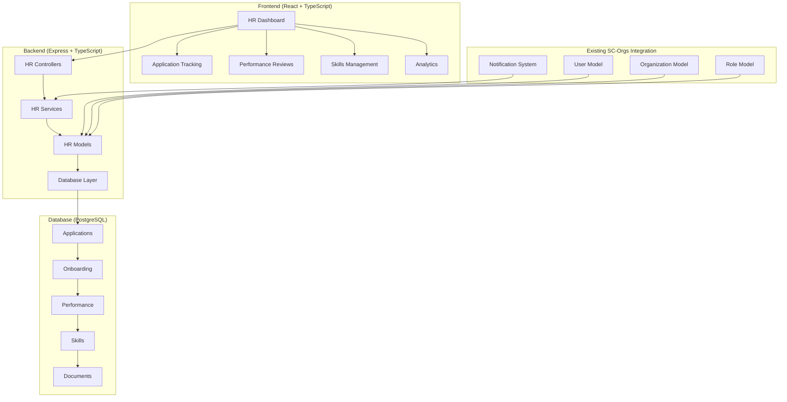

# Design Document

## Overview

The HR Management System extends the existing SC-Orgs platform with professional-grade human resources tools for Star Citizen organizations. This system integrates seamlessly with the current authentication, organization verification, and member management infrastructure while adding sophisticated workflows for recruitment, onboarding, performance evaluation, and organizational analytics.

The design leverages the existing Express.js backend, React frontend, and PostgreSQL database architecture, adding new models, controllers, and UI components specifically for HR functionality.

## Architecture

### System Integration Points

The HR system integrates with existing SC-Orgs components:

- **Authentication**: Uses existing Discord OAuth and RSI verification systems
- **Organizations**: Extends current organization model and role-based permissions
- **Users**: Leverages existing user profiles and verification status
- **Notifications**: Utilizes existing notification system for HR workflows
- **Events**: Integrates with event system for attendance tracking

### High-Level Architecture



## Components and Interfaces

### Backend Components

#### 1. HR Models

**ApplicationModel**
- Manages recruitment applications and status tracking
- Integrates with existing User and Organization models
- Handles application lifecycle and status transitions

**OnboardingModel**
- Manages member onboarding workflows and checklists
- Creates role-specific onboarding templates
- Tracks completion status and progress

**PerformanceReviewModel**
- Handles performance review creation and management
- Stores review data with structured ratings and feedback
- Manages review cycles and notifications

**SkillModel**
- Tracks member skills and Star Citizen certifications
- Manages skill verification and validation workflows
- Provides skill gap analysis and reporting

**DocumentModel**
- Manages organizational documents and policies
- Handles version control and access permissions
- Tracks document acknowledgments and compliance

#### 2. HR Controllers

**ApplicationController**
- `/api/organizations/:id/applications` - Application management endpoints
- Handles application submission, review, and status updates
- Manages bulk operations and filtering

**OnboardingController**
- `/api/organizations/:id/onboarding` - Onboarding workflow endpoints
- Manages onboarding templates and task completion
- Tracks progress and generates completion certificates

**PerformanceController**
- `/api/organizations/:id/performance` - Performance review endpoints
- Handles review creation, submission, and analytics
- Manages improvement plans and goal tracking

**SkillController**
- `/api/organizations/:id/skills` - Skills and certification endpoints
- Manages skill tracking, verification, and reporting
- Provides skill search and gap analysis

**DocumentController**
- `/api/organizations/:id/documents` - Document management endpoints
- Handles document upload, organization, and access control
- Manages acknowledgments and compliance tracking

**AnalyticsController**
- `/api/organizations/:id/hr-analytics` - HR analytics and reporting
- Provides dashboard metrics and trend analysis
- Generates exportable reports and insights

#### 3. HR Services

**ApplicationService**
- Business logic for application processing
- Integration with notification system for status updates
- Automated invite code generation for approved applications

**OnboardingService**
- Template management and customization
- Progress tracking and completion validation
- Integration with role-based permissions

**PerformanceService**
- Review cycle management and scheduling
- Performance analytics and trend analysis
- Improvement plan creation and tracking

**SkillService**
- Skill verification workflows
- Certification expiration tracking
- Organization-wide skill analytics

**DocumentService**
- Document organization and version control
- Permission-based access management
- Compliance tracking and reporting

### Frontend Components

#### 1. RTK Query API Slice Extensions

**HR API Endpoints** (extending existing `apiSlice.ts`)
- All HR endpoints follow existing RTK Query patterns with proper caching, tags, and transformations
- Consistent error handling and optimistic updates where appropriate
- Integration with existing tag system for cache invalidation

#### 2. HR Dashboard Components (Following Design System)

**HRDashboard**
- Main dashboard using `Paper` components with `glass` variant and `lg` size
- Key metrics displayed using `StatLarge`, `StatMedium`, and `StatSmall` typography components
- Integration with existing organization dashboard patterns using consistent spacing (`--spacing-section`)
- Role-based view customization using existing permission system and glass morphism effects
- Real-time data updates with RTK Query hooks (`useGetHRAnalyticsQuery`) and proper cache management

**ApplicationTracker**
- Application pipeline using `Paper` components with `glass-elevated` variant for cards
- Status chips using existing `Chip` component with `status` variant and cyberpunk color scheme
- Bulk actions using existing `Button` components with `primary` and `secondary` variants
- Filtering using existing `FilterGroup` and `Dropdown` components
- Optimistic updates with RTK Query mutations following existing patterns

**PerformanceCenter**
- Review cards using `Paper` with `glass` variant and consistent `--radius-paper` styling
- Performance metrics using `StatMedium` and `StatSmall` typography components
- Analytics charts following existing analytics component patterns
- Form elements using existing `Input`, `Textarea`, and `Button` components with glass morphism styling

**SkillsMatrix**
- Skills overview using grid layout with `--gap-grid-md` spacing
- Skill cards using `Paper` components with `glass-subtle` variant
- Skill tags using `Chip` components with brand color variants (`bg-brand-secondary/20`, `text-brand-secondary`)
- Verification status using existing status color utilities (`text-success`, `text-warning`, `text-error`)

**DocumentLibrary**
- Hierarchical navigation using existing `Sidebar` and `SidebarItem` components
- Document cards using `Paper` with `glass` variant and interactive hover effects
- File upload using existing form patterns with glass morphism styling
- Search using existing `Input` component with `input-glass` styling

#### 3. Workflow Components (Following Design System Patterns)

**ApplicationForm**
- Form layout using `Paper` with `glass` variant and `--spacing-card-lg` padding
- Input fields using existing `Input` and `Textarea` components with `input-glass` styling
- File upload using existing upload patterns with glass morphism effects
- Submit buttons using `Button` component with `primary` variant and cyberpunk hover effects
- Form validation using existing validation patterns with error states using `text-error` utility

**OnboardingChecklist**
- Checklist items using `Paper` components with `glass-subtle` variant
- Task completion using `Checkbox` components with custom styling
- Progress bar using existing progress patterns with brand color gradients
- Role-specific templates displayed using `ComponentTitle` and `ComponentSubtitle` typography
- Completion status using `Chip` components with success/warning color variants

**PerformanceReviewForm**
- Review sections using `Paper` with `glass` variant and consistent spacing
- Rating scales using existing `RadioGroup` components with cyberpunk styling
- Comment fields using `Textarea` with `input-glass` styling
- Historical comparison using existing analytics chart patterns
- Goal tracking using interactive cards with glass morphism effects

**SkillProfile**
- Skill categories using `SectionTitle` and `SectionSubtitle` typography
- Individual skills displayed as `Chip` components with proficiency level colors
- Certification cards using `Paper` with `glass-elevated` variant
- Verification badges using existing status color utilities
- Add/edit modals using existing `Dialog` component with glass styling

## Data Models

### Application Management

```typescript
interface Application {
  id: string;
  organization_id: string;
  user_id: string;
  status: 'pending' | 'under_review' | 'interview_scheduled' | 'approved' | 'rejected';
  application_data: {
    cover_letter?: string;
    experience?: string;
    availability?: string;
    custom_fields?: Record<string, any>;
  };
  reviewer_id?: string;
  review_notes?: string;
  rejection_reason?: string;
  invite_code?: string;
  created_at: Date;
  updated_at: Date;
}

interface ApplicationStatusHistory {
  id: string;
  application_id: string;
  status: string;
  changed_by: string;
  notes?: string;
  created_at: Date;
}
```

### Onboarding Management

```typescript
interface OnboardingTemplate {
  id: string;
  organization_id: string;
  role_name: string;
  tasks: OnboardingTask[];
  estimated_duration_days: number;
  is_active: boolean;
  created_at: Date;
  updated_at: Date;
}

interface OnboardingTask {
  id: string;
  title: string;
  description: string;
  required: boolean;
  estimated_hours: number;
  order_index: number;
}

interface OnboardingProgress {
  id: string;
  organization_id: string;
  user_id: string;
  template_id: string;
  status: 'not_started' | 'in_progress' | 'completed' | 'overdue';
  completed_tasks: string[];
  completion_percentage: number;
  started_at: Date;
  completed_at?: Date;
  created_at: Date;
  updated_at: Date;
}
```

### Performance Management

```typescript
interface PerformanceReview {
  id: string;
  organization_id: string;
  reviewee_id: string;
  reviewer_id: string;
  review_period_start: Date;
  review_period_end: Date;
  status: 'draft' | 'submitted' | 'acknowledged';
  ratings: {
    [category: string]: {
      score: number;
      comments?: string;
    };
  };
  overall_rating: number;
  strengths: string[];
  areas_for_improvement: string[];
  goals: PerformanceGoal[];
  created_at: Date;
  updated_at: Date;
}

interface PerformanceGoal {
  id: string;
  title: string;
  description: string;
  target_date: Date;
  status: 'not_started' | 'in_progress' | 'completed' | 'cancelled';
  progress_percentage: number;
}
```

### Skills Management

```typescript
interface Skill {
  id: string;
  name: string;
  category: 'pilot' | 'engineer' | 'medic' | 'security' | 'logistics' | 'leadership';
  description: string;
  verification_required: boolean;
  created_at: Date;
  updated_at: Date;
}

interface UserSkill {
  id: string;
  user_id: string;
  skill_id: string;
  proficiency_level: 'beginner' | 'intermediate' | 'advanced' | 'expert';
  verified: boolean;
  verified_by?: string;
  verified_at?: Date;
  notes?: string;
  created_at: Date;
  updated_at: Date;
}

interface Certification {
  id: string;
  user_id: string;
  organization_id: string;
  name: string;
  description: string;
  issued_date: Date;
  expiration_date?: Date;
  issued_by: string;
  certificate_url?: string;
  created_at: Date;
  updated_at: Date;
}
```

### Document Management

```typescript
interface Document {
  id: string;
  organization_id: string;
  title: string;
  description?: string;
  file_path: string;
  file_type: string;
  file_size: number;
  folder_path: string;
  version: number;
  requires_acknowledgment: boolean;
  access_roles: string[];
  uploaded_by: string;
  created_at: Date;
  updated_at: Date;
}

interface DocumentAcknowledgment {
  id: string;
  document_id: string;
  user_id: string;
  acknowledged_at: Date;
  ip_address?: string;
}
```

### Analytics and Reporting

```typescript
interface HRAnalytics {
  organization_id: string;
  period_start: Date;
  period_end: Date;
  metrics: {
    applications: {
      total_received: number;
      approval_rate: number;
      average_processing_time_days: number;
      conversion_rate: number;
    };
    onboarding: {
      total_started: number;
      completion_rate: number;
      average_completion_time_days: number;
      overdue_count: number;
    };
    performance: {
      reviews_completed: number;
      average_rating: number;
      improvement_plans_active: number;
      goals_completion_rate: number;
    };
    skills: {
      total_skills_tracked: number;
      verification_rate: number;
      skill_gaps: SkillGap[];
    };
    retention: {
      member_turnover_rate: number;
      average_tenure_days: number;
      exit_reasons: Record<string, number>;
    };
  };
}

interface SkillGap {
  skill_name: string;
  required_count: number;
  current_count: number;
  gap_percentage: number;
}
```

## Error Handling

### Application Processing Errors

- **Invalid Application Data**: Validation errors for incomplete or malformed applications
- **Duplicate Applications**: Prevention of multiple active applications from same user
- **Permission Errors**: Unauthorized access to application management functions
- **Status Transition Errors**: Invalid status changes or workflow violations

### Onboarding Workflow Errors

- **Template Not Found**: Missing or inactive onboarding templates
- **Task Completion Errors**: Invalid task completion attempts
- **Progress Tracking Errors**: Inconsistent progress state management
- **Permission Violations**: Unauthorized onboarding management access

### Performance Review Errors

- **Review Cycle Conflicts**: Overlapping or invalid review periods
- **Rating Validation Errors**: Invalid rating values or missing required fields
- **Access Control Errors**: Unauthorized review access or modification
- **Goal Management Errors**: Invalid goal creation or progress updates

### Skills and Certification Errors

- **Verification Failures**: Invalid skill verification attempts
- **Certification Expiration**: Handling of expired certifications
- **Skill Validation Errors**: Invalid skill assignments or proficiency levels
- **Permission Errors**: Unauthorized skill management operations

## Testing Strategy

### Unit Testing

**Model Testing**
- Application lifecycle management
- Onboarding progress tracking
- Performance review calculations
- Skill verification workflows
- Document access control

**Service Testing**
- Business logic validation
- Integration with existing services
- Error handling and edge cases
- Permission enforcement
- Data transformation and validation

**Controller Testing**
- API endpoint functionality
- Request/response validation
- Authentication and authorization
- Error response formatting
- Integration with OpenAPI specification

### Integration Testing

**Database Integration**
- Model relationships and constraints
- Transaction handling and rollback
- Data consistency and integrity
- Performance optimization
- Migration and seed data

**External Service Integration**
- Notification system integration
- File upload and storage
- Email delivery (future)
- Analytics and reporting
- Existing SC-Orgs system integration

**API Integration**
- End-to-end workflow testing
- Cross-controller functionality
- Permission system integration
- Rate limiting and security
- OpenAPI specification compliance

### Frontend Testing

**Component Testing**
- HR dashboard functionality
- Form validation and submission
- Data visualization components
- User interaction workflows
- Responsive design testing

**Integration Testing**
- API communication
- State management
- Route navigation
- Authentication flows
- Error handling and display

**End-to-End Testing**
- Complete HR workflows
- Multi-user scenarios
- Permission-based access
- Data persistence
- Cross-browser compatibility

## Integration Points

### Notification System Integration
- **HR Notification Types**: Extend existing `NotificationEntityType` enum with HR-specific types:
  - `HR_APPLICATION_SUBMITTED`, `HR_APPLICATION_STATUS_CHANGED`
  - `HR_ONBOARDING_STARTED`, `HR_ONBOARDING_COMPLETED`, `HR_ONBOARDING_OVERDUE`
  - `HR_PERFORMANCE_REVIEW_DUE`, `HR_PERFORMANCE_REVIEW_SUBMITTED`
  - `HR_SKILL_VERIFIED`, `HR_CERTIFICATION_EXPIRING`
  - `HR_DOCUMENT_REQUIRES_ACKNOWLEDGMENT`, `HR_ANALYTICS_ALERT`
- **Notification Service Integration**: Use existing `NotificationService` for all HR notifications
- **Custom Notification Content**: Leverage `NotificationSerializer` for HR-specific message generation
- **Notification Preferences**: Integrate with existing user notification preferences system

### Activity Tracking Integration
- **Activity Service Extension**: Extend existing `ActivityService` with HR activity types
- **Activity Feed Integration**: HR activities appear in user's main activity feed
- **Activity Categories**: Professional development, compliance, performance, skills
- **Timeline Integration**: HR milestones integrated with user's organizational timeline

### Event System Integration
- **Attendance Tracking**: Link event attendance with HR performance metrics
- **Skill Verification**: Events can serve as skill verification opportunities
- **Training Events**: Special event category for HR training and development
- **Performance Correlation**: Event participation tracked in performance reviews

### User and Organization Integration
- **User Model Extension**: HR data linked to existing user profiles
- **Organization Model Integration**: HR metrics included in organization analytics
- **Role System Integration**: HR permissions use existing organization role system
- **Member Lifecycle**: HR processes integrated with organization membership lifecycle

### Package Management and Validation
- **Yarn Usage**: All package management operations use `yarn` instead of `npm`
- **OpenAPI Validation**: All input validation handled through OpenAPI specifications for self-validating endpoints
- **Schema-Driven Development**: Request/response validation automatically enforced by OpenAPI schemas

## Security Considerations

### Access Control

- **Role-Based Permissions**: Integration with existing organization role system
- **HR-Specific Roles**: Additional HR Manager, Recruiter, and Supervisor roles
- **Data Segregation**: Organization-specific data isolation
- **Audit Logging**: Comprehensive activity tracking for HR operations

### Data Protection

- **Sensitive Information**: Secure handling of performance reviews and personal data
- **Document Security**: Encrypted file storage and access control
- **Privacy Compliance**: GDPR-compliant data handling and retention
- **Audit Trails**: Complete history of HR data access and modifications

### API Security

- **Authentication**: JWT token validation for all HR endpoints
- **Authorization**: Permission-based endpoint access control
- **Rate Limiting**: Protection against abuse and DoS attacks
- **OpenAPI Validation**: All input validation handled through OpenAPI specifications for self-validating endpoints
- **Schema-Driven Validation**: Request/response validation automatically enforced by OpenAPI schemas

## Performance Optimization

### Database Optimization

- **Indexing Strategy**: Optimized indexes for HR queries and reporting
- **Query Optimization**: Efficient joins and aggregations for analytics
- **Caching Layer**: Redis caching for frequently accessed HR data
- **Pagination**: Efficient pagination for large datasets

### API Performance

- **Response Optimization**: Minimal data transfer and efficient serialization
- **Bulk Operations**: Batch processing for multiple HR operations
- **Async Processing**: Background processing for heavy operations
- **Connection Pooling**: Optimized database connection management

### Frontend Performance

- **Component Optimization**: Efficient React component rendering with proper memoization
- **RTK Query State Management**: Optimized caching with appropriate `keepUnusedDataFor` values and selective cache invalidation
- **Data Loading**: Progressive loading using RTK Query's built-in pagination and infinite scroll patterns
- **Caching Strategy**: RTK Query automatic caching with proper tag-based invalidation following existing patterns

## Deployment and Monitoring

### Deployment Strategy

- **Database Migrations**: Automated schema updates for HR tables
- **Feature Flags**: Gradual rollout of HR functionality
- **Backward Compatibility**: Seamless integration with existing SC-Orgs features
- **Environment Configuration**: Separate HR-specific configuration options

### Monitoring and Analytics

- **Performance Metrics**: HR system performance and usage tracking
- **Error Monitoring**: Comprehensive error tracking and alerting
- **User Analytics**: HR feature adoption and usage patterns
- **Business Metrics**: HR workflow effectiveness and organizational insights

### Maintenance and Support

- **Documentation**: Comprehensive HR system documentation
- **Training Materials**: User guides for HR functionality
- **Support Workflows**: Help desk integration for HR-related issues
- **Update Procedures**: Streamlined HR system updates and maintenance